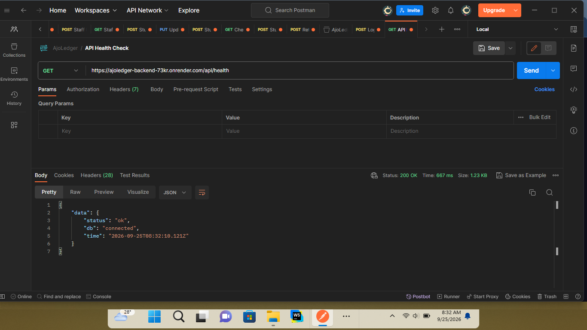
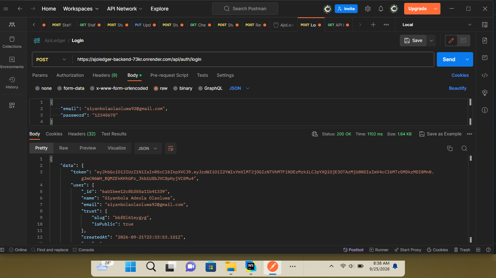
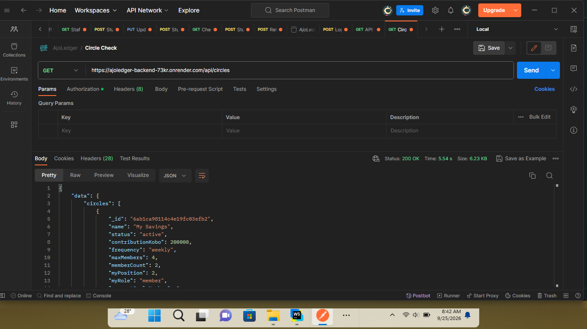
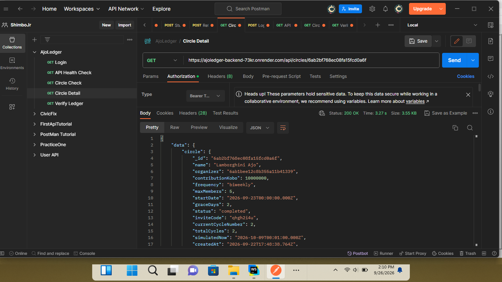
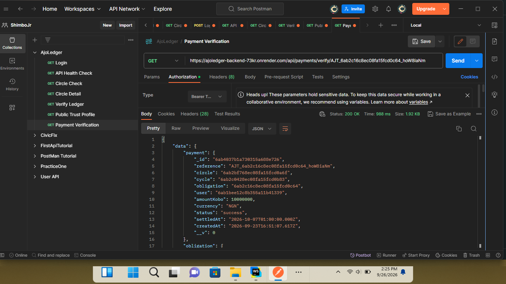
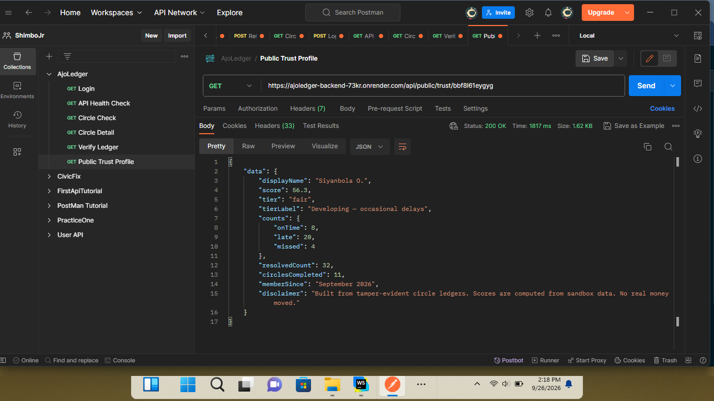

# AjoLedger API Documentation

> **AjoLedger — Save together. Provably.**
>
> REST API for managing rotating savings circles (ajo/esusu/susu), member obligations, Paystack contributions, an append-only ledger, notifications, and Reliability/Trust Profiles.
>
> **Sandbox notice:** The application is designed around demo/sandbox workflows. The public trust endpoint explicitly describes its scores as being computed from sandbox data and states that no real money is moved.

## Table of Contents

- [Overview](#overview)
- [Base URLs](#base-urls)
- [Technology Stack](#technology-stack)
- [Authentication](#authentication)
- [Money and Dates](#money-and-dates)
- [Response Format](#response-format)
- [Error Handling](#error-handling)
- [Rate Limits](#rate-limits)
- [Endpoints](#endpoints)
  - [Health](#health)
  - [Authentication](#authentication-endpoints)
  - [Circles](#circle-endpoints)
  - [Ledger](#ledger-endpoints)
  - [Payments](#payment-endpoints)
  - [Notifications](#notification-endpoints)
  - [Trust Profiles](#trust-profile-endpoints)
  - [Public Trust Profiles](#public-trust-endpoints)
  - [Jobs](#job-endpoint)
  - [Paystack Webhook](#paystack-webhook)
- [Circle Lifecycle](#circle-lifecycle)
- [Reliability Score](#reliability-score)
- [Data Model](#data-model)
- [Security](#security)
- [Environment Variables](#environment-variables)
- [Local Development](#local-development)
- [Testing](#testing)
- [Deployment](#deployment)
- [Related Repositories](#related-repositories)

---

## Overview

AjoLedger provides a backend API for a rotating savings circle:

1. A user registers or logs in.
2. An authenticated user creates a circle and becomes its organizer.
3. Other users join using an invite code.
4. The organizer controls the payout/member order while the circle is still forming.
5. Starting the circle creates the required cycles and contribution obligations.
6. Members contribute through a Paystack checkout.
7. Verified contributions update the obligation, cycle pot, and append-only ledger.
8. The engine advances cycles, identifies missed payments, records payouts, and completes the circle.
9. Notifications and optional email reminders are generated by the scheduler.
10. Members can verify the ledger chain and export the ledger as CSV.
11. A user can optionally publish a Reliability/Trust Profile through a public URL.

The API uses Express and MongoDB/Mongoose and returns JSON for application endpoints, with CSV for the ledger export.

---

## Base URLs

### Production

```text
https://ajoledger-backend-73kr.onrender.com/api
```

### Local development

The repository's example environment uses port `1929`:

```text
http://localhost:1929/api
```

The server configuration itself defaults to port `3000` when `PORT` is not supplied, so the frontend and backend must use the same configured port.

### Health check

```text
GET https://ajoledger-backend-73kr.onrender.com/api/health
```

---

## Technology Stack

| Area | Technology |
|---|---|
| Runtime | Node.js 20+ |
| Framework | Express 4 |
| Database | MongoDB / MongoDB Atlas |
| ODM | Mongoose 8 |
| Authentication | JWT |
| Password hashing | bcryptjs |
| Validation | Zod |
| Payments | Paystack |
| Email | Nodemailer / Brevo HTTPS API / console transport |
| Security | Helmet, CORS, rate limiting |
| Scheduling | node-cron + protected HTTP job endpoint |
| Testing | Vitest, Supertest, MongoDB Memory Server |
| Deployment | Render |

---

# Authentication

Protected endpoints require a JWT access token in the `Authorization` header:

```http
Authorization: Bearer <JWT>
```

Tokens are issued by:

- `POST /api/auth/register`
- `POST /api/auth/login`

The token contains the user's ID as the JWT `sub` claim and expires according to `JWT_EXPIRES_IN` (default: `7d`).

The server verifies the token and then loads the corresponding user from MongoDB for each protected request.

### Example

```http
GET /api/auth/me
Authorization: Bearer eyJ...
```

---

# Money and Dates

## Amounts

All monetary amounts are integers in **kobo**, not naira.

Examples:

| Naira | Kobo |
|---:|---:|
| ₦100 | `10000` |
| ₦1,000 | `100000` |
| ₦10,000 | `1000000` |

Circle contribution limits:

- Minimum: ₦100 (`10000` kobo)
- Maximum: ₦1,000,000 (`100000000` kobo)

Paystack transactions use NGN and receive the kobo amount directly.

## Frequency

Supported circle frequencies:

```text
weekly
biweekly
monthly
```

## Dates

API date values are normally returned as ISO 8601 date strings.

---

# Response Format

Successful JSON responses are wrapped in a `data` property.

Example:

```json
{
  "data": {
    "token": "eyJ...",
    "user": {
      "_id": "66...",
      "name": "Ada Example",
      "email": "ada@example.com"
    }
  }
}
```

The health endpoint follows the same convention:

```json
{
  "data": {
    "status": "ok",
    "db": "connected",
    "time": "2026-09-26T12:00:00.000Z"
  }
}
```

---

# Error Handling

Application errors use this structure:

```json
{
  "error": {
    "code": "BAD_REQUEST",
    "message": "Circle is not active"
  }
}
```

Validation errors may additionally include `details`:

```json
{
  "error": {
    "code": "VALIDATION_ERROR",
    "message": "Invalid request data",
    "details": [
      {
        "field": "email",
        "message": "Invalid email address"
      }
    ]
  }
}
```

## Common status codes

| Status | Meaning |
|---:|---|
| `200` | Successful request |
| `201` | Resource created |
| `400` | Invalid request/business rule |
| `401` | Missing, invalid, or expired authentication |
| `403` | Authenticated but not authorized |
| `404` | Resource/route not found |
| `409` | Conflict, such as duplicate email/member |
| `422` | Validation failure |
| `429` | Rate limit exceeded |
| `500` | Unexpected server error |
| `502` | Upstream Paystack failure |

In production, unexpected errors do not expose stack traces.

---

# Rate Limits

Authentication endpoints are protected by a rate limiter:

- `POST /api/auth/register`
- `POST /api/auth/login`
- **10 requests per minute per IP**

Public trust profiles are protected by:

- `GET /api/public/trust/:slug`
- **60 requests per minute per IP**

Rate-limit responses use:

```json
{
  "error": {
    "code": "RATE_LIMITED",
    "message": "Too many requests. Please wait a moment and try again."
  }
}
```

---

# Endpoints

## Health

### `GET /api/health`

Checks API availability and MongoDB connection state.

**Authentication:** Not required.

### Response

```json
{
  "data": {
    "status": "ok",
    "db": "connected",
    "time": "2026-09-26T12:00:00.000Z"
  }
}
```

---

# Authentication Endpoints

## Register

### `POST /api/auth/register`

Creates a new AjoLedger account, hashes the password, creates a private trust profile, and returns a JWT.

**Authentication:** Not required.

**Rate limit:** 10/min/IP.

### Request

```json
{
  "name": "Ada Example",
  "email": "ada@example.com",
  "password": "securepassword"
}
```

### Validation

- `name`: 2–60 characters
- `email`: valid email address
- `password`: 8–72 characters

### Response — `201`

```json
{
  "data": {
    "token": "eyJ...",
    "user": {
      "_id": "66...",
      "name": "Ada Example",
      "email": "ada@example.com",
      "trust": {
        "slug": "example-slug",
        "isPublic": false
      }
    }
  }
}
```

The password hash is never returned.

### Possible errors

- `409 CONFLICT` — email already registered
- `422 VALIDATION_ERROR` — invalid input
- `429 RATE_LIMITED` — rate limit exceeded

---

## Login

### `POST /api/auth/login`

Authenticates an existing user and returns a JWT.

**Authentication:** Not required.

**Rate limit:** 10/min/IP.

### Request

```json
{
  "email": "ada@example.com",
  "password": "securepassword"
}
```

### Response — `200`

```json
{
  "data": {
    "token": "eyJ...",
    "user": {
      "_id": "66...",
      "name": "Ada Example",
      "email": "ada@example.com"
    }
  }
}
```

### Possible errors

- `401 UNAUTHORIZED` — invalid email/password
- `422 VALIDATION_ERROR`
- `429 RATE_LIMITED`

---

## Current User

### `GET /api/auth/me`

Returns the authenticated user's profile.

**Authentication:** Required.

### Response

```json
{
  "data": {
    "user": {
      "_id": "66...",
      "name": "Ada Example",
      "email": "ada@example.com",
      "trust": {
        "slug": "example-slug",
        "isPublic": false
      }
    }
  }
}
```

---

# Circle Endpoints

## Create Circle

### `POST /api/circles`

Creates a new circle. The authenticated user becomes the organizer and first member.

**Authentication:** Required.

### Request

```json
{
  "name": "Family Ajo",
  "contributionKobo": 1000000,
  "frequency": "monthly",
  "maxMembers": 6,
  "startDate": "2026-10-01",
  "graceDays": 2
}
```

### Validation

| Field | Rules |
|---|---|
| `name` | 3–60 characters |
| `contributionKobo` | Integer, ₦100–₦1,000,000 |
| `frequency` | `weekly`, `biweekly`, or `monthly` |
| `maxMembers` | Integer, 2–12 |
| `startDate` | Valid date, today or future |
| `graceDays` | Integer, 0–5; defaults to `2` |

### Response — `201`

```json
{
  "data": {
    "circle": {
      "_id": "66...",
      "name": "Family Ajo",
      "organizer": "66...",
      "contributionKobo": 1000000,
      "frequency": "monthly",
      "maxMembers": 6,
      "startDate": "2026-10-01T00:00:00.000Z",
      "graceDays": 2,
      "status": "forming",
      "inviteCode": "ABC12345",
      "currentCycleNumber": 0,
      "totalCycles": 0
    },
    "inviteUrl": "https://sjr-ajoledger.vercel.app/join/ABC12345"
  }
}
```

---

## List My Circles

### `GET /api/circles`

Returns circles where the authenticated user is a member.

**Authentication:** Required.

### Response

```json
{
  "data": {
    "circles": [
      {
        "_id": "66...",
        "name": "Family Ajo",
        "status": "active",
        "contributionKobo": 1000000,
        "frequency": "monthly",
        "maxMembers": 6,
        "memberCount": 6,
        "myPosition": 2,
        "myRole": "member",
        "currentCycleNumber": 1,
        "nextDueDate": "2026-10-01T00:00:00.000Z",
        "myObligationStatus": "pending"
      }
    ]
  }
}
```

Organizers additionally receive the circle's `inviteCode`.

---

## Preview Circle by Invite Code

### `GET /api/circles/join/:code`

Returns limited circle information so an unauthenticated user can inspect an invitation before joining.

**Authentication:** Not required.

### Response

```json
{
  "data": {
    "circleId": "66...",
    "name": "Family Ajo",
    "organizer": {
      "firstName": "Ada"
    },
    "contributionKobo": 1000000,
    "frequency": "monthly",
    "maxMembers": 6,
    "spotsLeft": 3,
    "status": "forming",
    "joinable": true,
    "reason": null
  }
}
```

Possible `reason` values explain why a circle is not joinable, such as:

- Circle already started
- Circle completed
- Circle full

---

## Join Circle

### `POST /api/circles/join/:code`

Adds the authenticated user to a forming circle.

**Authentication:** Required.

### Response — `201`

```json
{
  "data": {
    "circleId": "66...",
    "position": 4
  }
}
```

### Possible errors

- `404 NOT_FOUND` — invalid invite code
- `409 CONFLICT` — already a member or circle is full
- `400 BAD_REQUEST` — circle already started/completed

---

## Get Circle Detail

### `GET /api/circles/:id`

Returns detailed circle information for members.

**Authentication:** Required.

Non-members receive a `404` rather than a `403` to avoid leaking the existence of private circles.

### Response shape

```json
{
  "data": {
    "circle": {},
    "members": [],
    "currentCycle": {},
    "myObligation": {},
    "obligations": [],
    "myRole": "organizer",
    "myPosition": 1,
    "isOrganizer": true,
    "lastClosedCycle": null
  }
}
```

Member objects include a limited trust summary:

```json
{
  "trust": {
    "score": 85.7,
    "tier": "good"
  }
}
```

The organizer sees the invite code; ordinary members do not.

---

## Reorder Payout Positions

### `PATCH /api/circles/:id/payout-order`

Changes the payout/member order before a circle starts.

**Authentication:** Required.

**Authorization:** Organizer only.

**Circle status:** `forming` only.

### Request

```json
{
  "order": [
    "66member01",
    "66member02",
    "66member03",
    "66member04"
  ]
}
```

The array must contain exactly the existing member IDs.

### Response

```json
{
  "data": {
    "updated": true
  }
}
```

The backend performs the reorder transactionally because membership positions are uniquely constrained within a circle.

---

## Start Circle

### `POST /api/circles/:id/start`

Locks the forming circle into its active lifecycle.

**Authentication:** Required.

**Authorization:** Organizer only.

**Requirements:** At least 2 members.

### Response

```json
{
  "data": {
    "circle": {
      "_id": "66...",
      "status": "active",
      "currentCycleNumber": 1,
      "totalCycles": 4
    }
  }
}
```

Starting the circle creates:

- One cycle per member
- Cycle 1 as `open`
- Remaining cycles as `scheduled`
- One contribution obligation per member for cycle 1

---

## Remove Member

### `DELETE /api/circles/:id/members/:userId`

Removes a member from a forming circle.

**Authentication:** Required.

**Authorization:** Organizer only.

**Circle status:** `forming`.

The organizer cannot remove themselves.

After removal:

1. Remaining members are renumbered.
2. The invite code is rotated.
3. A new invite URL may be returned.

### Response

```json
{
  "data": {
    "removed": true,
    "membersRemaining": 4,
    "inviteUrl": "https://sjr-ajoledger.vercel.app/join/NEWCODE"
  }
}
```

---

# Ledger Endpoints

The ledger is designed as an append-only chain. Contribution/payout/missed-payment entries contain sequence and hash information, and mutation operations on the ledger model are blocked at the Mongoose schema level.

## List Ledger

### `GET /api/circles/:id/ledger`

Returns cursor-paginated ledger entries for circle members.

**Authentication:** Required.

### Query parameters

| Parameter | Description |
|---|---|
| `limit` | Number of entries; default `20`, maximum `50` |
| `cursor` | Last seen `seq` value |

### Example

```http
GET /api/circles/66abc/ledger?limit=20&cursor=40
```

### Response

```json
{
  "data": {
    "entries": [
      {
        "_id": "66...",
        "circle": "66...",
        "seq": 41,
        "cycleNumber": 3,
        "user": {
          "_id": "66...",
          "name": "Ada Example"
        },
        "type": "contribution",
        "amountKobo": 1000000,
        "reference": "AJT_...",
        "sandbox": true,
        "meta": {},
        "prevHash": "...",
        "hash": "..."
      }
    ],
    "nextCursor": 41,
    "hasMore": true
  }
}
```

---

## Verify Ledger Chain

### `GET /api/circles/:id/ledger/verify`

Recomputes/verifies the circle's ledger hash chain.

**Authentication:** Required.

### Success response

The service returns a verification result containing fields such as:

```json
{
  "data": {
    "ok": true,
    "checked": 25
  }
}
```

When a broken chain is detected, the response can identify the relevant sequence/reason.

---

## Download Ledger CSV

### `GET /api/circles/:id/ledger.csv`

Downloads the circle ledger as CSV.

**Authentication:** Required.

**Authorization:** Circle members only.

The server returns:

```http
Content-Type: text/csv; charset=utf-8
Content-Disposition: attachment; filename="ledger-family-ajo-2026-09-26.csv"
```

---

# Payment Endpoints

AjoLedger uses Paystack for the checkout flow.

## Initialize Contribution

### `POST /api/circles/:id/contribute`

Creates a payment record and initializes a Paystack transaction for the authenticated member's current pending obligation.

**Authentication:** Required.

**Request body:** None.

The amount is read from the server-side obligation; the client cannot choose or override the amount.

### Response

```json
{
  "data": {
    "authorizationUrl": "https://checkout.paystack.com/...",
    "reference": "AJT_66..._Ab12Cd34"
  }
}
```

The frontend redirects the user to `authorizationUrl`.

### Important business rules

The server checks:

- Circle exists
- Circle is active
- Caller is a member
- An open cycle exists
- Caller has a pending obligation
- The contribution window has not closed

If a previous initialized payment exists for the obligation, it is marked `abandoned` and a fresh Paystack reference is created.

---

## Verify Payment

### `GET /api/payments/verify/:reference`

Verifies the transaction with Paystack and settles it if valid.

**Authentication:** Required.

Only the owner of the payment can verify it.

### Response example

```json
{
  "data": {
    "payment": {
      "reference": "AJT_66..._Ab12Cd34",
      "status": "success"
    },
    "obligation": {
      "status": "paid_on_time",
      "paidAt": "2026-09-26T12:00:00.000Z"
    },
    "settled": true,
    "alreadySettled": false
  }
}
```

The settlement process verifies:

- Paystack transaction status is `success`
- Currency is `NGN`
- Paystack amount matches the stored obligation amount
- Paystack reference matches the internal reference

The operation is idempotent: a previously successful payment can be verified again without applying the contribution twice.

### Payment status outcomes

| Condition | Result |
|---|---|
| Valid before due date | `paid_on_time` |
| Valid after due date but before `closesAt` | `paid_late` |
| After `closesAt` | Payment is failed; obligation is not settled |
| Already settled | `alreadySettled: true` |
| Paystack failure/abandoned status | Payment marked `failed` |
| Currency mismatch | Payment marked `failed` |
| Amount mismatch | Payment marked `failed` |
| Reference mismatch | Payment marked `failed` |

Successful settlement updates the obligation, payment, cycle pot, and ledger within a MongoDB transaction.

---

# Notification Endpoints

## List Notifications

### `GET /api/notifications`

Returns the latest notifications for the authenticated user and the unread count.

**Authentication:** Required.

The endpoint returns up to 30 newest notifications.

### Response

```json
{
  "data": {
    "notifications": [
      {
        "_id": "66...",
        "kind": "reminder",
        "title": "Contribution due today",
        "body": "Your contribution is due today.",
        "readAt": null,
        "emailStatus": "sent",
        "createdAt": "2026-09-26T08:00:00.000Z"
      }
    ],
    "unreadCount": 1
  }
}
```

---

## Mark One Notification Read

### `PATCH /api/notifications/:id/read`

Marks a notification as read.

**Authentication:** Required.

Only the notification owner can modify it.

### Response

```json
{
  "data": {
    "ok": true,
    "notification": {}
  }
}
```

The operation is idempotent.

---

## Mark All Notifications Read

### `POST /api/notifications/read-all`

Marks all unread notifications belonging to the authenticated user as read.

### Response

```json
{
  "data": {
    "ok": true,
    "marked": 4
  }
}
```

---

# Trust Profile Endpoints

AjoLedger calculates a Reliability/Trust Profile from resolved contribution obligations.

## Get My Trust Profile

### `GET /api/me/trust`

**Authentication:** Required.

### Response

```json
{
  "data": {
    "score": 85.7,
    "tier": "good",
    "label": "Reliable — rarely misses",
    "onTime": 5,
    "late": 1,
    "missed": 0,
    "resolved": 6,
    "circlesJoined": 2,
    "circlesCompleted": 1,
    "memberSince": "2026-07-01T00:00:00.000Z",
    "slug": "ada-example",
    "isPublic": false,
    "publicUrl": "https://sjr-ajoledger.vercel.app/t/ada-example"
  }
}
```

A slug is lazily generated if the user does not already have one.

---

## Update Trust Settings

### `PATCH /api/me/trust`

**Authentication:** Required.

### Request

```json
{
  "isPublic": true
}
```

Or regenerate the public slug:

```json
{
  "regenerateSlug": true
}
```

Both options may be supplied together.

### Response

```json
{
  "data": {
    "slug": "new-example-slug",
    "isPublic": true,
    "publicUrl": "https://sjr-ajoledger.vercel.app/t/new-example-slug"
  }
}
```

Regenerating the slug immediately invalidates the previous public link.

---

# Public Trust Endpoints

## Get Public Trust Profile

### `GET /api/public/trust/:slug`

Returns a limited public trust profile.

**Authentication:** Not required.

**Rate limit:** 60/min/IP.

The endpoint intentionally exposes an allow-listed set of fields and does not expose the user's email or individual payment amounts.

### Response

```json
{
  "data": {
    "displayName": "Ada E.",
    "score": 85.7,
    "tier": "good",
    "tierLabel": "Reliable — rarely misses",
    "counts": {
      "onTime": 5,
      "late": 1,
      "missed": 0
    },
    "resolvedCount": 6,
    "circlesCompleted": 1,
    "memberSince": "July 2026",
    "disclaimer": "Built from tamper-evident circle ledgers. Scores are computed from sandbox data. No real money moved."
  }
}
```

### Privacy behavior

Unknown slugs and private profiles intentionally return the same `404` response:

```json
{
  "error": {
    "code": "NOT_FOUND",
    "message": "Trust profile not found"
  }
}
```

This prevents the endpoint from revealing whether a private profile exists.

The response is cacheable for 60 seconds:

```http
Cache-Control: public, max-age=60
```

---

# Job Endpoint

## Run Engine + Reminders

### `POST /api/jobs/run`

Runs the scheduled business jobs manually.

**Authentication:** Not JWT-based.

**Required header:**

```http
x-cron-secret: <CRON_SECRET>
```

The value is compared using a timing-safe comparison.

### Response

```json
{
  "data": {
    "engine": {},
    "reminders": {
      "notificationsCreated": 2,
      "emailsSent": 2
    },
    "ranAt": "2026-09-26T12:00:00.000Z"
  }
}
```

This endpoint is intended for external cron services when the hosting environment may sleep.

The built-in scheduler can also run automatically every 15 minutes when:

```env
ENABLE_CRON=true
```

---

# Paystack Webhook

## `POST /api/webhooks/paystack`

Receives Paystack webhook events.

**Authentication:** Paystack HMAC signature.

**Required header:**

```http
x-paystack-signature: <HMAC-SHA512 signature>
```

The server verifies the signature against the raw request body using `PAYSTACK_SECRET_KEY`.

### Supported event

```text
charge.success
```

For a valid event:

1. The server responds with HTTP `200` immediately.
2. The payment reference is extracted.
3. Payment settlement runs asynchronously.
4. Other event types are acknowledged without processing.

An invalid signature receives:

```http
401
```

```json
{
  "error": "Invalid signature"
}
```

The webhook route is deliberately mounted before `express.json()` so the raw request body remains available for HMAC verification.

---

# Demo Simulation Endpoint

## Simulate Time

### `POST /api/circles/:id/simulate`

Available only when:

```env
DEMO_MODE=true
```

**Authentication:** Required.

**Authorization:** Circle organizer only.

### Request

```json
{
  "action": "pass-due-date"
}
```

Supported actions:

```text
pass-due-date
close-cycle
```

### `pass-due-date`

Moves the circle's simulated clock to one hour after the current cycle's due date, then runs reminders and the engine.

### `close-cycle`

Moves the simulated clock to one minute after the current cycle's closing time, then runs the engine and reminders.

This feature exists to make the cycle/reminder/payment lifecycle demonstrable without waiting for real dates.

---

# Circle Lifecycle

A circle follows this lifecycle:

```text
forming
   |
   | organizer starts circle
   v
active
   |
   | final cycle closes
   v
completed
```

## Forming

- Members can join.
- Organizer can reorder payout positions.
- Organizer can remove members.
- Invite code is available to the organizer.
- At least 2 members are required to start.

## Active

Starting the circle:

- locks membership changes,
- creates one cycle per member,
- assigns each cycle a recipient,
- opens cycle 1,
- schedules later cycles,
- creates cycle 1 obligations.

## Completed

When the final cycle closes, the engine completes the circle and creates relevant completion notifications.

---

# Reliability Score

The score is computed from resolved obligations.

Weights:

- Paid on time = `1`
- Paid late = `0.5`
- Missed = `0`

Formula:

```text
score =
((onTime × 1) + (late × 0.5))
/ (onTime + late + missed)
× 100
```

The result is rounded to one decimal place.

A score is not produced until at least **3 resolved obligations** exist. Before that, the tier is:

```text
building
```

Implemented tiers:

| Score | Tier |
|---:|---|
| 90–100 | `excellent` |
| 70–89.9 | `good` |
| 50–69.9 | `fair` |
| Below 50 | `poor` |

The backend also exposes human-readable tier labels.

---

# Data Model

Main MongoDB collections:

```text
User
  └── trust profile

Circle
  ├── Membership
  ├── Cycle
  │    └── Obligation
  ├── Payment
  └── LedgerEntry

Notification
```

## User

Stores:

- name
- email
- bcrypt password hash
- trust slug
- trust visibility

The password hash uses `select: false` and is explicitly removed from returned user objects.

## Circle

Stores:

- organizer
- contribution amount
- frequency
- member limit
- start date
- grace period
- status
- invite code
- current cycle
- total cycles
- demo `simulatedNow`

## Membership

Stores:

- circle
- user
- payout position
- role
- joined date

Unique indexes prevent duplicate membership and duplicate positions within a circle.

## Cycle

Stores:

- cycle number
- due date
- closing date
- recipient
- status
- pot total

## Obligation

Stores each member's contribution obligation for a cycle.

Statuses:

```text
pending
paid_on_time
paid_late
missed
```

## Payment

Tracks the Paystack transaction lifecycle:

```text
initialized
success
failed
abandoned
```

## LedgerEntry

Stores the append-only financial/event history:

- sequence number
- cycle
- user
- entry type
- amount
- reference
- previous hash
- current hash
- metadata
- sandbox flag

Mutation hooks prevent updates/deletes/replacements of existing ledger entries.

## Notification

Stores in-app notification state and email delivery status.

---

# Security

The backend implements several security controls:

### Authentication

- JWT Bearer authentication
- JWT expiration
- User lookup on every protected request
- Password hashing with bcrypt

### Request validation

Zod validates registration, login, circle creation, and payout-order requests before controllers process them.

### HTTP security

Helmet is enabled.

### CORS

- Private API routes accept the configured `CLIENT_URL`.
- Public trust routes allow cross-origin GET/OPTIONS requests because they are designed to be shared publicly.

### Rate limiting

Authentication and public trust endpoints are rate-limited.

### Payment security

- Paystack secret stays server-side.
- Payment amount comes from the server-side obligation.
- Paystack status, currency, amount, and reference are verified.
- Webhooks use HMAC-SHA512 signatures.
- Payment settlement is transactional and idempotent.

### Privacy

- Password hashes are never returned.
- Public trust data uses an explicit allow-list.
- Email and payment amounts are excluded from the public trust response.
- Private and unknown public trust profiles return the same 404 response.

### Logging

Morgan's custom logger masks sensitive query parameters such as `token`, `password`, and `secret` and does not log request bodies.

---

# Environment Variables

Copy `.env.example` to `.env`.

```env
NODE_ENV=development
PORT=1929

MONGODB_URI=mongodb+srv://<user>:<password>@<cluster>.mongodb.net/ajoledger?retryWrites=true&w=majority

JWT_SECRET=change-me-to-a-long-random-secret
JWT_EXPIRES_IN=7d

CLIENT_URL=http://localhost:5173

PAYSTACK_SECRET_KEY=sk_test_xxxxxxxxxxxxxxxxxxxxxxxxxxxxxxxxxxxxxxxx
PAYSTACK_BASE_URL=https://api.paystack.co

MAIL_TRANSPORT=console
BREVO_API_KEY=
SMTP_HOST=
SMTP_PORT=587
SMTP_USER=
SMTP_PASS=
MAIL_FROM=noreply@ajoledger.example.com

REMINDER_DAYS_BEFORE=2
ENABLE_CRON=false
CRON_SECRET=change-me-to-another-long-random-secret
DEMO_MODE=true
```

## Required variables

```text
MONGODB_URI
JWT_SECRET
CLIENT_URL
PAYSTACK_SECRET_KEY
CRON_SECRET
```

`JWT_SECRET` and `CRON_SECRET` must be at least 32 characters according to the server configuration.

## Mail transports

### Console

```env
MAIL_TRANSPORT=console
```

Useful for development/demo environments.

### SMTP

```env
MAIL_TRANSPORT=smtp
```

Requires:

```env
SMTP_HOST=
SMTP_PORT=
SMTP_USER=
SMTP_PASS=
```

### Brevo

```env
MAIL_TRANSPORT=brevo
```

Requires:

```env
BREVO_API_KEY=
```

The configured `MAIL_FROM` address must be a verified sender when using Brevo.

---

# Local Development

```bash
git clone https://github.com/ShimboJr/AjoLedger-Backend.git
cd AjoLedger-Backend

cp .env.example .env
npm install

npm run dev
```

The server starts using the configured `PORT`.

For the frontend, configure:

```env
VITE_API_URL=http://localhost:1929/api
VITE_DEMO_MODE=true
```

Make sure `CLIENT_URL` matches the frontend origin.

---

# Testing

The backend uses Vitest, Supertest, and MongoDB Memory Server.

Run:

```bash
npm test
```

The repository includes tests covering areas including:

- authentication
- circles
- payments
- public trust profiles
- ledger
- ledger engine
- CSV generation
- dates
- mailer behavior

Watch mode:

```bash
npm run test:watch
```

---

# Deployment

The production backend is deployed on Render.

Production API:

```text
https://ajoledger-backend-73kr.onrender.com
```

Recommended production environment values:

```env
NODE_ENV=production
CLIENT_URL=https://sjr-ajoledger.vercel.app
ENABLE_CRON=false
DEMO_MODE=true
```

If an external cron service is used, call:

```http
POST /api/jobs/run
x-cron-secret: <CRON_SECRET>
```

If using the built-in scheduler instead:

```env
ENABLE_CRON=true
```

The built-in scheduler runs every 15 minutes.

---

# Related Repositories

- Backend: https://github.com/ShimboJr/AjoLedger-Backend
- Frontend: https://github.com/ShimboJr/AjoLedger-Frontend
- Live application: https://sjr-ajoledger.vercel.app
- Production API: https://ajoledger-backend-73kr.onrender.com

---

# API Screenshots

### API Health Check



### Login

 

### Circles List



### Circle / Ledger Flow



### Ledger Verification


### Payment Verification



### Public Trust Profile



---

## License

MIT
