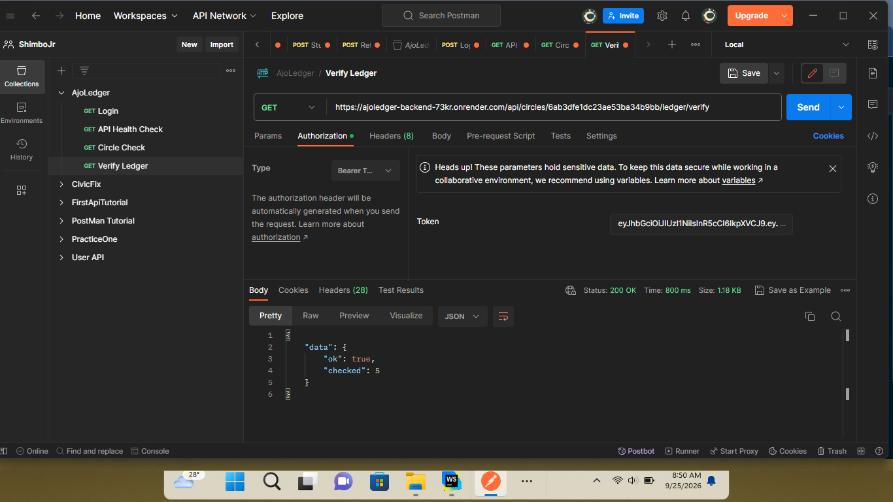

# AjoLedger — Backend

> **Sandbox mode: no real money moves.** All payments run through Paystack **test mode**; all payouts are simulated ledger entries.

The API server for **AjoLedger** — a tamper-evident rotating savings circle (ajo / esusu / susu) platform. It replaces WhatsApp screenshots and notebooks with a shared, append-only ledger every member can verify, and turns saving discipline into a portable, shareable **Reliability Score**.

🔗 **Live API:** `https://ajoledger-backend-73kr.onrender.com/api`
🔗 **Live app:** [https://sjr-ajoledger.vercel.app/](https://sjr-ajoledger.vercel.app/)
🔗 **Frontend repo:** [ShimboJr/AjoLedger-Frontend](https://github.com/ShimboJr/AjoLedger-Frontend)
📄 **Full API reference:** [API_DOCUMENTATION.md](./API_DOCUMENTATION.md)

---

## Screenshots

### Health Check


### Login

 

### Circles List


### Ledger Verify



---

## What it does

- Members join a **circle** and contribute a fixed amount each cycle; one member is paid out per cycle, on a rotating schedule.
- Every contribution, missed payment, and payout is recorded as an entry in a **hash-chained, append-only ledger** — tampering is mathematically detectable, not just discouraged by convention.
- Every member gets a **Reliability Score**, computed from their on-time/late/missed history, with an optional public, shareable profile link.
- A **cycle engine** automatically closes overdue cycles, marks missed payments, records payouts, and opens the next cycle — driven by real time in production, or fast-forwarded on demand via demo controls.

## Features

- JWT authentication (register, login, `/me`)
- Circle lifecycle: create → invite link → join → reorder payout positions → start → auto-progressing cycles → completed
- Real Paystack **test-mode** payments with signature-verified webhooks and idempotent settlement (safe under concurrent webhook + callback calls)
- Append-only, SHA-256 hash-chained ledger with a `/verify` endpoint that detects tampering
- CSV ledger export (Excel-safe, formula-injection-protected)
- Automatic cycle closing + missed-payment detection + payout recording
- Reliability Score with tiers (`building` → `poor` → `fair` → `good` → `excellent`) and a public, privacy-preserving shareable profile
- Email reminders (due soon / due today / overdue) via a pluggable mail transport — see [Email delivery](#email-delivery) below
- In-app notifications
- Demo-mode "simulate" controls to fast-forward a circle's clock for live demos, without waiting real days/weeks
- An external-cron-friendly `/jobs/run` endpoint, for hosts that don't keep a process alive 24/7

## Tech stack

| Layer | Technology |
|---|---|
| Runtime | Node.js 20+, Express 4 |
| Database | MongoDB Atlas, Mongoose 8 |
| Auth | JWT (jsonwebtoken), bcryptjs |
| Validation | Zod |
| Payments | Paystack REST API (test mode) |
| Email | Nodemailer (SMTP) or Brevo HTTP API, or console-logged in dev |
| Scheduling | node-cron (in-process) + `/jobs/run` (external-pinger-friendly) |
| Security | Helmet, CORS allowlist, express-rate-limit, timing-safe secret comparisons |
| Testing | Vitest, Supertest, mongodb-memory-server |
| Hosting | Render |

## Architecture notes

- **Money is always an integer in kobo** — never floats, never naira — throughout the database and service layer, to avoid rounding drift.
- **Domain time never calls `new Date()` directly.** Every time-sensitive operation reads `circleNow(circle)`, which returns `circle.simulatedNow` when set (demo mode) or the real time otherwise — so the entire engine, reminders, and payment late/on-time classification stay consistent whether running for real or fast-forwarded for a demo.
- **The ledger is append-only at the database layer**, not just by convention — Mongoose middleware throws on any `update`/`delete` operation against a `LedgerEntry`, and each entry's hash chains to the previous one.
- **Payment settlement is idempotent.** The Paystack webhook and the browser's callback-verification endpoint both call the same `settlePayment(reference)` function, so a payment is only ever applied once even if both fire for the same transaction.

## Getting started

### Prerequisites
- Node.js ≥ 20
- A MongoDB Atlas cluster (free tier is fine)
- A Paystack account (test/sandbox keys — no business verification needed for test mode)

### Setup

```bash
git clone https://github.com/ShimboJr/AjoLedger-Backend.git
cd AjoLedger-Backend
cp .env.example .env    # fill in the values — see table below
npm install
npm run dev              # starts on the PORT set in .env (1929 by default)
```

Visit `http://localhost:1929/api/health` — you should see `{ "data": { "status": "ok", "db": "connected", ... } }`.

### Seed demo data (optional)

```bash
npm run seed         # populates demo users, circles, and ledger history
npm run seed:reset    # wipes and rebuilds it
```

## Environment variables

| Variable | Required | Notes |
|---|---|---|
| `NODE_ENV` | — | `development` \| `production` \| `test` |
| `PORT` | — | defaults to 3000; `.env.example` uses 1929 |
| `MONGODB_URI` | ✅ | MongoDB Atlas connection string |
| `JWT_SECRET` | ✅ | ≥ 32 characters |
| `JWT_EXPIRES_IN` | — | default `7d` |
| `CLIENT_URL` | ✅ | your deployed frontend's URL — used for CORS and invite/callback links |
| `PAYSTACK_SECRET_KEY` | ✅ | must start with `sk_` — use `sk_test_...` |
| `PAYSTACK_BASE_URL` | — | default `https://api.paystack.co` |
| `MAIL_TRANSPORT` | — | `console` (default, safe) \| `smtp` \| `brevo` — see [Email delivery](#email-delivery) |
| `SMTP_HOST` / `SMTP_PORT` / `SMTP_USER` / `SMTP_PASS` | only if `MAIL_TRANSPORT=smtp` | — |
| `BREVO_API_KEY` | only if `MAIL_TRANSPORT=brevo` | from Brevo → Settings → SMTP & API |
| `MAIL_FROM` | — | must match a Brevo-verified sender when using `brevo` mode |
| `REMINDER_DAYS_BEFORE` | — | default 2 |
| `ENABLE_CRON` | — | `true`/`false`, default `false` — runs the in-process 15-minute scheduler |
| `CRON_SECRET` | ✅ | ≥ 32 characters — required regardless of `ENABLE_CRON` |
| `DEMO_MODE` | — | `true`/`false`, default `true` — gates the `/circles/:id/simulate` endpoint |

## Email delivery

**Render's free tier blocks outbound SMTP ports** (25, 465, 587), so `MAIL_TRANSPORT=smtp` will time out once deployed there, even though it works locally. Two working alternatives, both over plain HTTPS:

- **`console`** (default) — logs emails instead of sending them. Zero setup, always works.
- **`brevo`** — sends via Brevo's HTTPS transactional email API. Only needs a single **verified sender email** (no domain/DNS ownership required) — see [brevo.com](https://www.brevo.com). Free tier: 300 emails/day.

## Available scripts

| Script | What it does |
|---|---|
| `npm run dev` | Start with hot-reload (`node --watch`) |
| `npm start` | Start in production mode |
| `npm test` | Run the Vitest suite once |
| `npm run test:watch` | Run tests in watch mode |
| `npm run seed` | Populate demo data |
| `npm run seed:reset` | Wipe and re-populate demo data |

## Testing

```bash
npm test
```

Uses `mongodb-memory-server` for isolated test runs — no external database needed. Covers auth, circle lifecycle, payments/settlement idempotency, the ledger hash chain (including a deliberate tamper test), CSV escaping, the cycle engine, dates, and the mailer.

## Deployment (Render)

1. Create a new **Web Service** on Render, pointed at this repo.
2. **Root Directory** must be set explicitly if this backend lives in a subfolder of a monorepo — otherwise leave blank for a standalone repo.
3. **Build Command:** `npm install`
4. **Start Command:** `npm start`
5. Add every variable from the table above under **Environment**.
6. Set `CLIENT_URL` to your deployed frontend's exact URL (no trailing slash) — CORS depends on an exact match.
7. In your Paystack dashboard, set the **test-mode webhook URL** to `https://<your-render-url>/api/webhooks/paystack`.
8. Because Render's free tier can spin down when idle, consider pointing an external pinger (e.g. cron-job.org) at `POST /api/jobs/run` (with the `x-cron-secret` header) every 10–15 minutes to keep cycle-closing and reminders running reliably — this works alongside or instead of the in-process `ENABLE_CRON` scheduler.

## Project structure

```
src/
  app.js                 Express app: middleware, route mounting, error handler
  server.js               Boot: connects the DB, starts the scheduler, starts listening
  config/                 env validation (zod), DB connection, brand constants
  controllers/            Thin HTTP handlers — one per resource
  services/                Business logic: auth, circles, payments, ledger, engine,
                            reminders, trust, csv, mailer, paystack client
  models/                 Mongoose schemas: User, Circle, Membership, Cycle,
                            Obligation, Payment, LedgerEntry, Notification
  routes/                 Route → controller wiring
  middleware/             auth (JWT), validation (zod), rate limiting, error handler
  jobs/                   node-cron scheduler
  scripts/                seed.js
  utils/                  dates, money, hashing, ID generation
tests/                    Vitest test suites
```

## Security notes

- Passwords hashed with bcrypt (cost 10); password hashes are never returned by any endpoint.
- JWT-based auth; no session state server-side.
- Login responses are deliberately generic (don't reveal whether an email exists) and timing-safe (a dummy bcrypt comparison runs even for unknown emails).
- Paystack webhook signatures verified with HMAC-SHA512 and a timing-safe comparison; the cron secret is compared the same way.
- Payment amounts are **always** read from the server-side obligation record, never trusted from the request body.
- Helmet security headers, a CORS allowlist scoped to `CLIENT_URL` (with `/api/public/*` open, since those links are meant to be shared externally), and a 100kb JSON body limit.
- Ledger entries are immutable at the schema level, not just by application convention.

## Roadmap / limitations

This is a hackathon build. Real money movement would require, at minimum: business registration, a licensed payment partner relationship for holding/transferring funds (a pure payment-facilitator role does not license custody of pooled funds under most regulatory frameworks), KYC/AML on every member, and a reserve/dispute-handling policy for missed payments and chargebacks. None of that is implemented — this repository is a sandbox demonstrating the trust/ledger/scoring mechanics only.

## License

MIT
